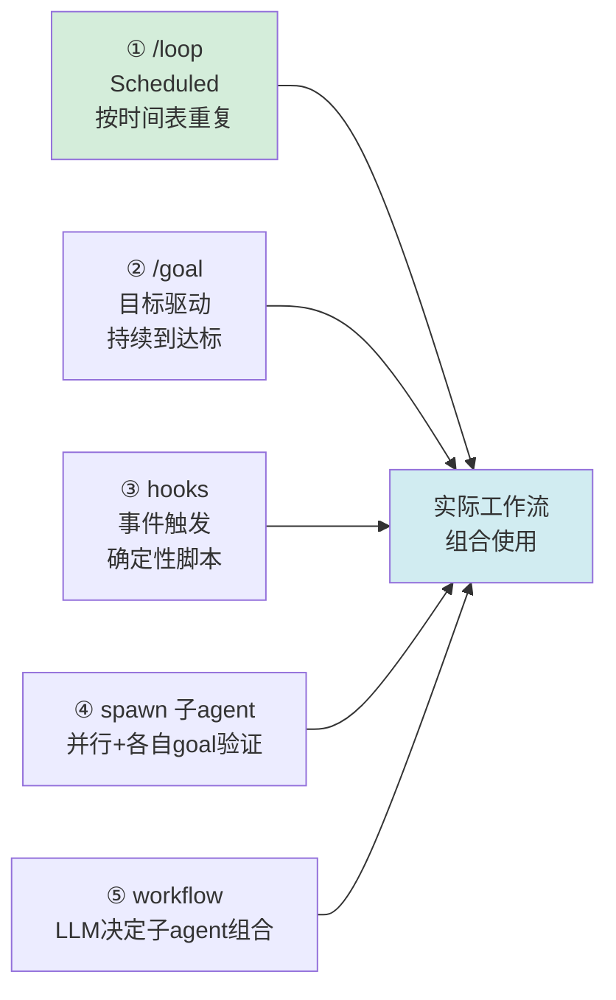
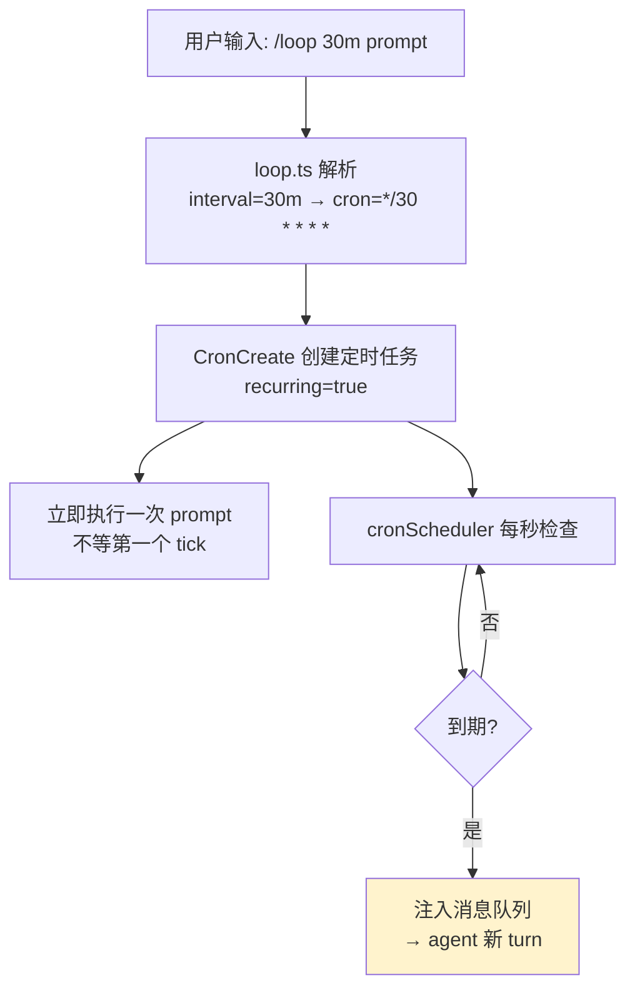

# 解读：/loop 到底是什么

> 本文是对 Datawhale《刚刚！Claude Code 的 /loop 实操教程来了》的解读笔记。
> 与本系列前三篇（架构文章）不同，这是一篇**实操教程**——解读重点放在"机制还原"和"与你既有实践的对照"。

---

## 一、TL;DR

作者用一个"监控竞品公众号更新"的真实场景，跑通了 Claude Code 的 `/loop`。读完全文最关键的认知是：**`/loop` 的本质就是 cron + prompt**——调度器只做一件蠢事（到时间把 prompt 塞给 agent），所有"智能"（判断状态、区分错误、决定做不做）都承载在你写的那段 prompt 里。

**一句话精华**：循环的智能不在基础设施里，在你设计的 prompt 里。

---

## 二、这篇的定位（与前 3 篇互补）

本系列前 3 篇都是"架构复盘"（讲怎么选型、怎么分层），这一篇是"动手教程"（讲一个命令怎么用）。它的价值不在宏大叙事，而在**把 /loop 这个被神化的概念还原成一个朴素机制**——读完你会知道：/loop 没有魔法，它和 crontab 的区别，只在于"塞给 agent 的不是死脚本，而是会判断的 prompt"。

---

## 三、agent 唤醒形态谱系（Loop Engineering 的设计空间）

很多人以为 Loop Engineering = /loop。文章先纠正了这个认知——agent 的自动化触发有五种形态：



```
字符画版本（五种形态 → 组合）:

① /loop (按时间表)   ─┐
② /goal (目标驱动)   ─┤
③ hooks (事件触发)   ─┼──▶ 实际工作流组合使用
④ spawn (并行验证)   ─┤
⑤ workflow(LLM编排) ─┘
```

文章只聚焦最基础的 ①（Scheduled loop）。但这个谱系本身就是一张有用的"设计地图"——选 loop 形态时，先问"我要的是定时、目标、事件、并行、还是动态编排"。

---

## 四、/loop 的机制真相：cron + prompt

作者读了 Claude Code 源码（loop.ts / cronScheduler.ts），还原出 /loop 的完整机制：



```
字符画版本:

/loop 30m <prompt>
      │
      ▼
loop.ts 解析 → cron="*/30 * * * *"
      │
      ▼
CronCreate 定时任务 + 立即执行首轮
      │
      ▼
cronScheduler 每秒检查 ──到期?──▶ 注入消息队列 → agent 新 turn
                  │否
                  └─继续检查
```

**关键发现：源码里没有 evaluator，没有自动判断"是否达标"的组件。** /loop 做的事就是"定时唤醒 prompt"。

那"判断达标"、"决定继续停止"、"区分错误类型"这些智能从哪来？——**全在你写的 prompt 里。**

这条结论和本系列第 3 篇的"Hook 优先于 Skill"是同一个硬币的两面：
- 第 3 篇说：**确定性的触发**（Hook）应该交给系统基础设施
- 本篇说：**智能的决策**（判断做什么）应该交给 prompt，不要指望基础设施

合起来就是贯穿系列的铁律：**基础设施做确定性的事（定时触发/100%采集），智能（判断/决策）交给 prompt 和模型。**

---

## 五、loop vs cron 的本质区别：异常处理

文章最有说服力的部分，是 token 失效场景下 loop 和 cron 的对比。微信公众平台 token 几小时就过期，API 返回 `ret=200003 invalid session`：

| 维度 | cron 脚本 | /loop |
|------|----------|-------|
| 正常情况 | 全量执行 | 正常同步 |
| 无更新 | 仍全量执行完整逻辑 | 极简一行响应（token 最省） |
| token 失效 | 报错→退出→日志躺 traceback→明天才发现断数据 | 判断是"凭证过期"非"内容问题"→**不重试**→标记状态→通知用户 |
| 下一轮 | 盲目重试（可能又挂） | 先读状态文件，轻量检测 token 是否恢复，未恢复直接跳过 |

> 核心差别叫"**控制器判断力**"：同样是"执行失败"，agent 区分了"内容层面的问题（值得重试）"和"基础设施层面的问题（需要人介入）"。这个判断不在调度器里，**在 prompt 里**。

这个对比清晰说明了 loop 的价值不在"自动化"（cron 也能自动），而在"**运行时判断**"——agent 遇到未预见的返回值，能基于上下文做合理决策，无需你在脚本里穷举所有错误码。

---

## 六、"先写 skill"的深意

> "Loop 的第一步不是 loop 本身的六大组件，而是处理问题的那个 skill，你得先有解决问题的方法。"

这条与系列呼应强烈：
- 第 1 篇（得物）：组件模块协议——把能力固化成可复用模块
- 第 2 篇（高德）：**Skill 化是 Agent 落地的工程前提**
- 本篇：**先有 skill，再设计 loop**

三篇的共识：**Agent/loop 的智能只是"编排层"，真正的业务能力必须先沉淀成确定性的 skill/组件。** 没有 skill 的 loop，就是空中楼阁。

---

## 七、与你本次实践的对照（实用增量）

这篇教程的场景是"监控公众号更新"，而本次任务我正好抓取了 4 篇公众号文章。文中方案和我的方案正好是两种互补路线：

| 维度 | 文中：wx-mp-rss-core | 本次：直接 fetch |
|------|---------------------|----------------|
| 原理 | 微信公众平台 API（需扫码登录拿 token） | 直接 GET `/s/` 文章 URL（公开内容服务端渲染） |
| 凭证 | token + cookies，约 3 天过期需重新扫码 | 无需登录 |
| 能力 | 可列任意公众号最新文章（适合**监控/发现**） | 只能抓已知 URL 的单篇（适合**一次性存档**） |
| 风险 | token 过期需维护 | 反爬升级时可能失效 |
| 适用 | 持续追踪多个号（文中 loop 场景） | 收集指定文章入 inbox（本次场景） |

**结论**：两种方案不冲突——若你要做"持续追踪 AI 公众号更新并自动入库"的 loop，用 wx-mp-rss-core 做发现层 + 直接 fetch 做存档层，正好拼成本文 inbox 的自动化上游。

---

## 八、批判性思考

1. **loop 的"自主性"有边界**。token 过期时 loop 只是"报告 + 等待扫码"，仍需人介入。文章诚实地展示这个边界——loop 擅长"内容层判断"，但"基础设施层修复"还得靠人。完全自主的 loop 还差一个"自动续期/自愈"能力。

2. **loop 质量高度依赖 prompt 工程**。"无更新时极简响应""token 失效时不重试"这些好行为，都依赖 prompt 里写清了决策规则。prompt 没写好，agent 可能啰嗦或盲目重试。所以 loop 的灵活性背后是**设计成本**——既是优点也是负担。

3. **/loop 没有 evaluator**。源码证实 /loop 是"定时循环"而非"目标驱动循环"。要"持续直到测试通过"得用 /goal 而非 /loop。文章聚焦 /loop 但没对比 /goal 的达标判断机制——这是 loop 形态谱系里值得单独展开的一支。

4. **loop 依赖 agent 在线**。/loop 的 cron 触发后，需要 Claude Code 环境（agent）在线才能执行。纯 cron 脚本独立运行。所以 loop 适合"人在环里"的开发场景，不适合完全无人值守的生产监控——这个前提文章没点明。

---

## 九、一句话收获

> /loop 不是魔法，是 cron + prompt——调度器负责"准时叫醒"，prompt 负责"醒来后怎么判断和行动"。所以设计 loop 的真正工作不在配置定时器，而在写好那段承载全部决策逻辑的 prompt；而写好 prompt 的前提，是你已经有了能解决问题的 skill。
