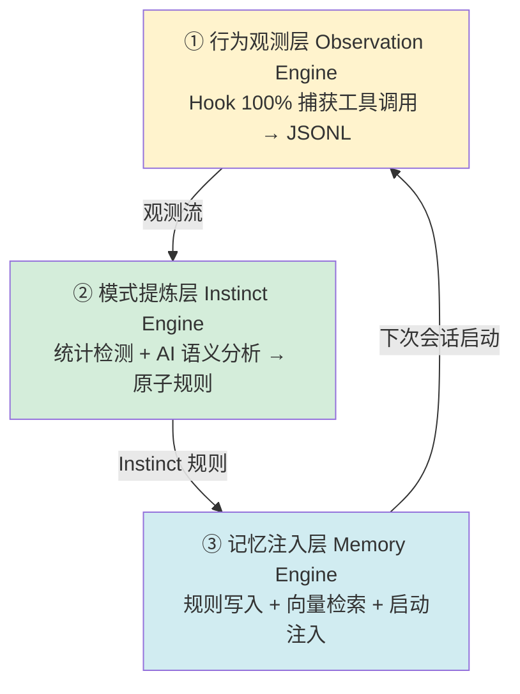
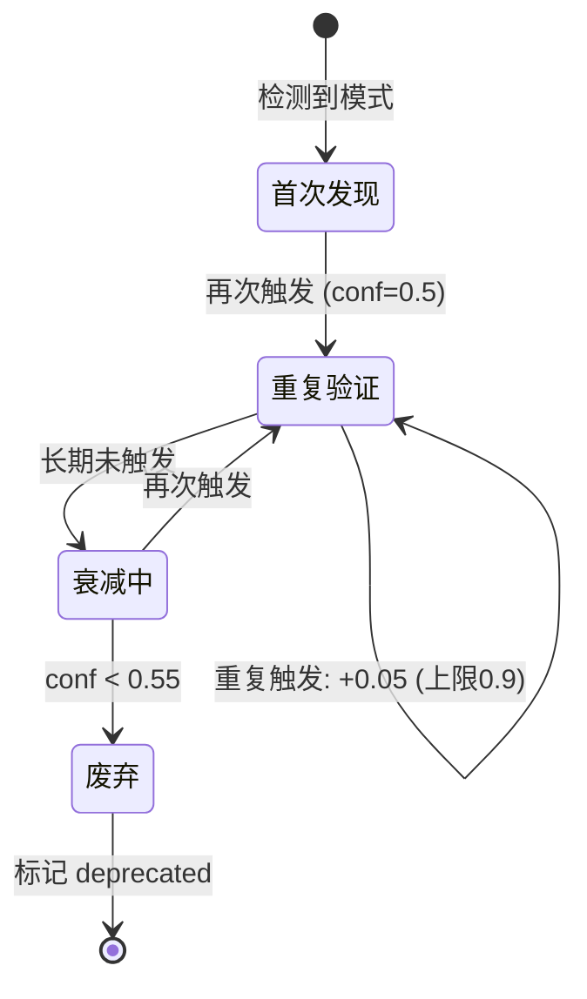

# 解读：给 Claude Code 装上"记忆与自我进化"

> 本文是对得物技术《让 Claude Code 拥有自我进化和记忆系统》的解读笔记。
> 本系列三篇（得物活动搭建 / 高德配图 / Claude Code 自进化）至此闭环——它们是"把 LLM 落地"这一主题在三个层面的展开。

---

## 一、TL;DR

Claude Code 每次新对话都是一张白纸。作者给它装了一套三层系统：**观测行为 → 提炼模式 → 注入记忆**，形成跨会话的自学习闭环。核心机制是用 Claude Code 原生 Hook 做"确定性触发"，替代依赖模型主动调用的 Skill，保证 100% 的行为采集率。

**一句话精华**：让 AI 拥有记忆的关键，不在于"存得多"，而在于**用确定性机制采集、用置信度演化筛选、用向量检索精准召回**——并且系统必须会"遗忘"。

---

## 二、为什么值得读

这篇是本系列里**最接近"通用基础设施"**的一篇——它的成果不只服务于某个业务，而是增强 AI 助手本身。稀缺价值有三：

1. **Hook 优先于 Skill 的洞察**：点破了"依赖模型主动调用"的不稳定性，是数据采集层的设计铁律。
2. **置信度演化模型**：给机器记忆装上"遗忘"机制，是防膨胀的核心，也是与"只增不减的日志"的本质区别。
3. **工程细节充分**：JSONL 格式、Jaccard 去重、Union-Find、本地 Embedding、分片归档——可以直接照着实现。

---

## 三、自学习闭环：三层架构



```
字符画版本（闭环）:

   ┌─── ① 观测层 ───┐
   │ Hook 100% 捕获  │
   │ → JSONL 观测流  │
   └───────┬───────┘
           ▼
   ┌─── ② 提炼层 ───┐
   │ 统计检测+AI语义 │
   │ → 原子 Instinct │
   └───────┬───────┘
           ▼
   ┌─── ③ 注入层 ───┐
   │ 写规则+向量检索 │
   │ → 启动时注入    │
   └───────┬───────┘
           │ 下次会话
           ▼
       回到 ① （闭环）
```

三层构成一个闭环：今天的行为被观测，会话结束时被提炼成规则，下次启动时被注入回来影响新的行为。**时间是这个系统的朋友**——文章称之为"知识复利"。

---

## 四、核心拆解：六个值得记住的设计

### 设计 1：Hook 优先于 Skill（全文最核心）

> "早期版本用 Skill 来触发学习，但 Skill 依赖模型主动调用，触发率不稳定。v2 改用 Claude Code 原生 Hook 机制，彻底解决了这个问题。"

这是全文最重要的一句话。Skill 触发是**概率性**的（取决于模型是否"想起来"调用），Hook 是**确定性**的（系统级回调，100% 触发）。作者用 PostToolUse 匹配 `.*` 保证全采集，用 Stop Hook 驱动会话结束时的分析。

这条原则与本系列前两篇遥相呼应：

| 文章 | 表述 |
|------|------|
| 第 1 篇（得物活动） | LLM 不参与流程路由，路由权握在代码里 |
| 第 2 篇（高德配图） | 模型负责感知，代码负责计算 |
| 第 3 篇（本文） | Hook 优先于 Skill，确定性触发替代模型主动调用 |

**共同主线：把确定性的部分用确定性机制锁定，把模型留给语义理解。**

### 设计 2：双路径提炼（统计 + AI 语义）

模式提炼用两条并行路径，互补：

- **路径 A 统计模式检测**：硬编码检测器识别高频工具调用序列。快、可靠，但只能发现"已知模式"。
- **路径 B AI 语义分析**：调用本地 Claude（haiku）理解观测摘要，捕获统计无法识别的深层规律。慢、有成本，但能发现"未知模式"。

这又是"确定性 + 概率性"的组合拳——和第 2 篇"确定性 Pipeline 扛重活 + Agent 做巧活"是同构的。

### 设计 3：置信度演化 —— 机器的"遗忘"

Instinct 规则不是静态的，而是一个有生命周期的实体：



```
字符画版本:

[*] ──检测到模式──▶ 首次发现(conf 0.5)
                       │ 再次触发
                       ▼
                  ┌─ 重复验证 ─┐
                  │            │
              +0.05│            │长期未触发
              (上限0.9)         │
                  │            ▼
                  └─▶       衰减中
                       │      │
                  再次触发      │ conf<0.55
                  (回血)       ▼
                       │    废弃(deprecated)──▶[*]
```

**首次 0.5 → 重复 +0.05（上限 0.9）→ 长期不触发 -0.05 → 低于 0.55 废弃**。

这是对生物记忆的建模：用进废退。它的深层价值是**让系统能淘汰过时规则**——当你的工作流改变后，旧规则会自然衰减消失，而不是永久占用上下文。没有"遗忘"的记忆系统必然膨胀崩塌。

### 设计 4：Jaccard 英文关键词去重

auto-evolve 用 Jaccard 相似度 + Union-Find 合并同义 Instinct，且**只提取英文关键词**。巧妙之处：用户可能用中文或英文描述同一习惯，基于英文技术词汇（Read/Edit/test/git）的相似度能跨语言识别同一意图。

### 设计 5：记忆召回四阶段（注入比存储更重要）

> "记忆存储完成只是第一步，召回才是让记忆产生价值的关键。"

四阶段：① SessionStart Hook 触发（不等用户请求）→ ② 用 `$PWD` + 最近 3 条 git commit 构造查询 → ③ 向量 Top-5 检索 → ④ 结构化注入系统提示。

关键细节：**查询用"项目名 + 最近 commit"**——这意味着记忆召回与当前工作上下文自动对齐，无需用户手动说明"我在做什么"。这是让记忆"主动而非被动"的设计。

### 设计 6：防膨胀是核心，不是附属

长期运行的系统，膨胀是头号杀手。作者在数据层和索引层都做了防护：

| 层级 | 机制 |
|------|------|
| Observations | 超 5MB/8000 行按月归档，主文件只留 30 天 |
| Instinct | 低置信度（<0.55）标记 deprecated |
| Memory raw | 按类型 TTL 60-90 天 |
| MEMORY.md | 超 160 行按优先级裁剪 |
| auto-evolved.md | 每次会话结束覆盖重写 |

> "原子性优先：先积累原子规则，等同类足够多再聚类聚合，避免过早抽象。"

这条"原子性优先"很重要——它防止了系统在数据不足时就生成大而空的"抽象规则"。先有足够样本，再提炼，是对 LLM 幻觉的工程防御。

---

## 五、与你当前环境的对照（延伸观察）

这篇文章描述的设计范式，与当前这个 Claude Code 工作环境的机制高度同构，可作为互相印证的参照：

- 文章的 **Memory 文件格式**（`name`/`description`/`metadata.type` + **Why** + **How to apply**）与本环境的 Memory 写入规范几乎一致——这是同一设计思想的不同实现。
- 文章的 **SessionStart Hook 自动注入记忆**，对应本会话开头注入的"recent context / 记忆时间线"——你看到的那条带 obs ID 的上下文，正是"记忆召回注入"的实际运行。
- 文章的 **跨会话经验召回**，对应本环境中 flow-deep 的 Stage -1、auto-skill 的知识库机制。

这说明：**"给 AI 助手装记忆"正在从单篇文章的探索，变成行业基础设施的标配**。文章结尾提到的 OpenClaw、Hermes 已有类似能力，也印证了这一趋势。

---

## 六、可迁移的模式

| 模式 | 一句话 | 系列呼应 |
|------|--------|---------|
| Hook 优先于 Skill | 确定性触发 > 模型主动调用 | ≈ 模型感知/代码计算 |
| 双路径提炼 | 统计硬规则 + AI 语义，互补 | ≈ Pipeline 重活 + Agent 巧活 |
| 置信度演化 | 强化 + 衰减 + 遗忘，淘汰过时 | （本文独有，精华） |
| 原子性优先 | 先积累再聚合，防过早抽象 | （本文独有） |
| 防膨胀分层 | 数据层 + 索引层双保险 | （本文独有） |
| 上下文对齐召回 | 用 PWD + commit 自动构造查询 | （本文独有） |
| 本地 Embedding | 隐私优先，向量检索本地化 | （本文独有） |

---

## 七、批判性思考

1. **量化数据缺乏测量细节**。78% Token 下降、80% 错误重复率下降——漂亮但没有测量方法、基线、样本量。相对可信的是"冷启动 10min→30s"（可观察）。读者应把这些数字当作"方向性参考"而非"精确结论"。

2. **Jaccard 去重的局限**。Jaccard 只看英文关键词字面重叠，会误并"语义不同但关键词相同"的规则（如"Read before Edit"与"Read after error to locate bug"）。矛盾的是：系统用 Embedding 做了 Memory 检索，却没用于 Instinct 去重——一致性可改进。

3. **"行为模式"≠"应该如此"（最大风险）**。系统提炼的是"你反复这么做"的模式，但频率不等于正确性。**它可能把坏习惯也固化为高置信度规则**。文章没有"行为好坏"的判断机制，只有频率和置信度。一个更完整的设计应引入"反馈信号"（如用户纠正次数）来区分"好习惯"和"坏习惯"。

4. **覆盖式写入的脆弱性**。auto-evolved.md 每次会话结束整体覆盖重写——若某次语义分析（路径 B）出错或幻觉，可能污染整个规则文件。虽有置信度过滤，但覆盖式写入缺乏版本回滚，建议保留历史版本便于追溯。

5. **"自我进化"的边界**。文章标题说"自我进化"，但实际是"自我提炼已有行为模式"。真正的进化还应包含"发现并采纳新策略"——这需要外部知识输入（如文章、最佳实践），而非仅观察用户自身。这是一个可拓展方向。

---

## 八、一句话收获

> 给 AI 装记忆的秘诀不是"存得多"，而是"会遗忘"——用确定性 Hook 采集行为，用置信度的强化与衰减让规则自然优胜劣汰，用向量检索在恰当的上下文精准召回。让时间成为系统的朋友，但必须给它装好"膨胀的刹车"。

---

## 九、系列总览（三篇贯穿主线）

本系列三篇文章，本质是同一主题在三个层面的展开：

| 层面 | 文章 | 核心机制 |
|------|------|---------|
| 人机交互流程 | 得物活动搭建 | interrupt/resume + 权限分级 |
| 在线内容生产 | 高德配图 | Pipeline 重活 + Agent 巧活 |
| AI 助手本身 | Claude Code 自进化 | Hook 采集 + 记忆注入 |

**贯穿三篇的铁律**：确定性的部分用确定性机制（代码/Hook/Pipeline/校验），模型只做语义感知。这是把 LLM 从"Demo"推向"生产"的共同门槛。
