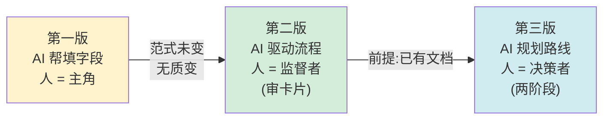
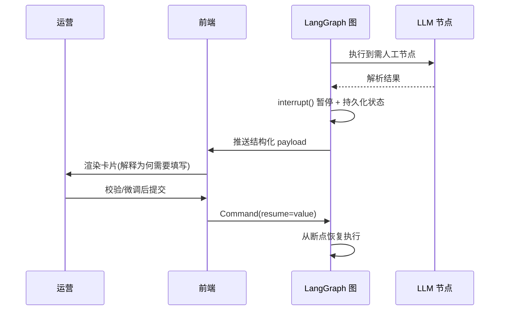

# 解读：从表单到 Agent

> 本文是对得物技术《从表单到 Agent：得物社区活动搭建的 AI 实践之路》的解读笔记。
> 解读重点是**决策推理**（为什么这么选）和**可迁移的模式**，而非复述技术清单。

---

## 一、TL;DR

一场营销活动，运营要在 3 个系统间跳转 10+ 次、填 40+ 字段。得物用三个版本把这条链路从「AI 帮你填表」演进到「两阶段 Agent + 聚合工作台」。

**一句话精华**：真正的质变不发生在「AI 帮你填字段」，而发生在「AI 成为流程主体、人只在关键节点踩刹车」的那个拐点上。围绕这个拐点，文章给出了一套**可控、可审计、可扩展**的工程化方案。

---

## 二、为什么值得读

市面上讲 Agent 的文章，大多停在"用了什么模型/框架"。这篇的稀缺之处有三：

1. **诚实地讲失败**：第一版上线后坦承"没有质的飞跃"，并精准定位原因——范式没变。这种自我推翻很少见。
2. **讲清了 Workflow vs Agent 的决策**：没有盲目追"完全自主 Agent"，而是给出了一个可操作的判断法则。
3. **工程妥协说得明白**：Form Host（表单托管 runtime）这种"不优雅但务实"的选择，被正面承认并讲清了边界。这是真实工程，不是 PPT 架构。

---

## 三、演进全景：三个范式



```
字符画版本:

[第一版]            [第二版]              [第三版]
AI帮填字段    →     AI驱动流程      →     AI规划路线
人=主角             人=监督者             人=决策者
(填表单)           (审卡片)             (两阶段)
 范式未变            前提:已有文档
  无质变 ────────────────▶
```

三版的本质是**人的角色在持续后撤**：从执行者 → 监督者 → 决策者。每一次后撤，对应 AI 承担更多"流程主体"职责。这正是文章反复强调的拐点。

---

## 四、核心拆解：六个值得记住的决策

### 决策 1：范式跃迁的判断标准

> "如果 AI 的角色只是'帮你填字段'，它永远不会带来质变。"

文章把 GitHub Copilot（行级补全 → Workspace）、ChatGPT（对话 → GPTs+Actions）作为旁证，归纳出一条规律：**AI 产品的价值跃迁，几乎都发生在 AI 从"辅助工具"变成"流程主体"的拐点上**。

这是一个可以拿来反观自己 AI 项目的试金石：你的 AI 是在"帮你填字段"，还是在"驱动流程"？

### 决策 2：Workflow vs Agent —— 有限状态机法则

这是全文最有"可操作性"的一段。作者给出一个经验法则：

- **流程能画成一张有限状态机图 → 用 Workflow**
- **更像"给目标，让 AI 自己想办法达到" → 用 Agent**
- **企业级多数是混合：大框架 Workflow 保可控，局部节点 Agent 提灵活**

并引用 Harrison Chase（LangChain 创始人）和 Klarna 客服的例子佐证：被广泛报道为"Agent"的系统，架构上往往是被精心设计的 Workflow。作者自己的系统中，LLM 是"节点内的执行者"，**不参与流程路由**——路由权牢牢握在代码手里。

这条法则的价值在于：它把"要不要上 Agent"从一个时髦问题，降维成了一个可判断的工程问题。

### 决策 3：LangGraph 的 interrupt/resume —— 人机交互语言

第二版的核心机制。流程执行到需要人输入处，调用 `interrupt()` 暂停整张图，把结构化 payload 推给前端渲染成卡片；人操作完，前端用 `Command(resume=value)` 推回，图从断点继续。



```
字符画版本:

运营           前端          LangGraph图       LLM节点
  |              |               |                |
  |              |               |--- 执行到人工节点 --->|
  |              |               |<-- 解析结果 --------|
  |              |               |                |
  |              |               | interrupt() 暂停 + 持久化
  |              |<-- payload ---|                |
  |<-- 渲染卡片 -|               |                |
  | (解释为什么需要填)           |                |
  |-- 校验微调 ->|               |                |
  |              |-- resume ---->|                |
  |              |               | 从断点恢复     |
```

关键细节：作者的中断卡片**不只是给表单，还解释"为什么需要你填这些、AI 已经做了什么、还缺什么"**。这呼应了微软 HAX 指南——信任建立在"让用户清楚系统为什么这么做"之上。反例是"假进度条"，那是在透支信任。

### 决策 4：权限分级 —— 最小权限原则

Stage 1（方案生成）**只读不写**，Stage 2 逐步开放写，发布权限必须人工确认触发。对应 AWS IAM 的最小权限原则：

| 权限层级 | 风险 | AI 是否可独立执行 |
|---------|------|-----------------|
| 读（查询数据） | 低 | ✅ 可以 |
| 写（创建/修改） | 中 | ⚠️ 需在受控阶段 |
| 发布/审批（影响线上） | 高 | ❌ 必须人工确认 |

这个三级模型可直接复用到任何"AI 操作真实业务数据"的场景。

### 决策 5：组件模块协议 —— 开闭原则 + 副作用控制

三个子设计层层递进：

1. **统一生命周期**：所有组件走相同节奏（初始化 → ... → 构建前 → 构建）。
2. **最关键的规则——初始化阶段不产生副作用**。源于一个真实 bug：有组件在初始化时偷偷调了后端保存接口，导致用户只是"看了一眼卡片"，系统就已经创建了活动数据。于是把所有写操作强制推迟到用户明确点"构建会场"之后。
3. **双轨注册**：显式选择（用户主动加）+ 条件注入（系统按规则自动加）。条件注入降低心智负担，但作者诚实地指出"系统行为变难预测"，于是用"已自动注入"提示来补救可解释性。
4. **声明式位置编排**：组件声明"我想放在末尾"，而不关心"末尾在哪"——三层关注点分离。

这是把面向对象的开闭原则（对扩展开放、对修改关闭）落地到了 AI 配置场景，且把"副作用时机"作为一等公民来约束。

### 决策 6：Form Host —— 务实的工程妥协

Stage 2 工作台右侧的组件表单，跑在一个独立构建的子项目里。原因：搭建器表单依赖 Formily 引擎和特定运行时，与新栈不兼容。作者没有重写几十个表单，而是复用旧运行时 + 消息协议通信。

> "虽然增加了架构复杂度，但把有限的开发精力放在了真正新增的价值上（预览交互、AI 辅助、草稿同步），而不是重造已有的轮子。"

这是全文最"真实"的一段。它承认了妥协，并给出了妥协的判定标准：**重造的成本 vs 新增价值的优先级**。

---

## 五、可迁移的模式（抽象出来带走）

| 模式 | 一句话 | 适用场景 |
|------|--------|---------|
| 范式跃迁试金石 | AI 是在"帮你填"还是"驱动流程"？ | 评估任何 AI 功能的潜力上限 |
| 有限状态机法则 | 能画成 FSM 用 Workflow，否则用 Agent | 选型决策 |
| interrupt/resume 协作 | 在关键节点暂停 + 解释 + 恢复 | 所有需人工确认的 AI 流程 |
| 三级权限模型 | 读/写/发布 分级授权 | AI 操作真实业务数据 |
| 副作用延后原则 | 初始化只读，确认后才写 | 任何有"草稿→提交"语义的系统 |
| 复用优于重造 | 不兼容就独立构建 + 消息协议 | 跨技术栈集成旧生态 |

---

## 六、批判性思考（延伸，非否定）

1. **缺少第三版的量化数据**。第一版提到"操作时间缩短"，但第二、三版没有给出可对比的效率数字（搭建时长、错误率、运营满意度）。作为实践记录，这是遗憾——读者难以判断"质变"到底变了多少。

2. **"完全自主 Agent 不现实"的边界在移动**。作者也承认 Agent CLI 是"未来"。文章定格在光谱中间位置，但没讨论**何时、以什么信号**可以向上一个层级迁移（例如当 LLM 对业务约束建立"体感"后）。补上这条"迁移判据"会更完整。

3. **条件注入的可解释性**靠"已自动注入"提示缓解，属于事后告知。长期若注入规则变复杂，运营仍可能困惑。一个可能的增强：让注入规则本身可被 AI 用自然语言解释（"我为什么给你加了这条 Feed"）。

4. **权限分级的"发布需人工确认"**在高频低风险场景会成为瓶颈。文章的会场搭建是低频高价值场景，模型成立；但若迁移到高频场景，可能需要在"信任度积累"后允许 AI 自主发布部分操作（带审计回滚）。

---

## 七、一句话收获

> 不要问"要不要用 Agent"，要问"我的流程能不能画成有限状态机"——能，就用 Workflow 把可控性握在手里，把 Agent 留给局部节点；然后把人的角色设计成"在关键节点踩刹车的监督者"，用 interrupt/resume 让每一次人工介入都带着解释。
