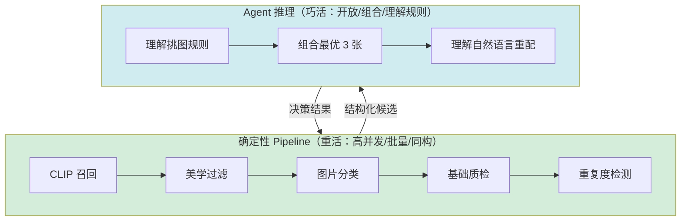

# 解读：从 Workflow 到 HermesAgent

> 本文是对高德技术《高德扫街榜配图全链路演进：从 Workflow 到 HermesAgent 的语言驱动实践》的解读笔记。
> 本系列三篇文章（得物活动搭建 / 高德配图 / Claude Code 自进化）出自同一技术脉络，解读时会做交叉呼应。

---

## 一、TL;DR

高德扫街榜的配图，表面是"给榜单挑几张图"，实际是一条六段式生产链路（召回→粗排→精排→兜底→质检→准出）。旧链路用 Workflow 串 50+ SQL 和脚本，维护难、迭代慢。重构后用 **"确定性 Pipeline 扛重活 + Agent 做巧活"** 的混合架构，单榜单生产从 24 小时缩短到 30 分钟（提效 48 倍），并支持产运用自然语言发起重配。

**一句话精华**：把 LLM/VLM 当作"会看图的感知器"，而不是"会算数的决策器"——感知交给模型，计算和校验死死握在代码手里。

---

## 二、为什么值得读

如果说第 1 篇（得物活动搭建）讲的是"如何让 Agent 驱动一个人机交互流程"，这一篇讲的是**"如何让 Agent/VLM 跑在高并发、高成本、高风险的在线生产链路里"**。它的稀缺价值在工程密度：

1. **生产级容错清单**：集中重试的故障放大、结构化输出逃逸、多机会话一致性——这些坑大部分讲 Agent 的文章根本不提，而它们才是 Agent 上生产的真问题。
2. **黑盒评分的拆解方法**：把"图好不好"拆成三域十五维度，是 prompt 工程的典范案例。
3. **"少补但补准"的质量哲学**：兜底不强行凑数，体现对线上体验的克制。

---

## 三、架构全景：重活与巧活的分工



```
字符画版本:

┌──── 确定性 Pipeline (重活) ────┐    ┌──── Agent 推理 (巧活) ────┐
│ CLIP召回→美学过滤→分类→质检  │ →→→│ 理解规则/组合选图/理解NL  │
│ (高并发/批量/同构/可并行)     │ 结构化候选 │ (开放/组合/需理解规则)   │
└───────────────────────────────┘ ←← └──────────────────────────┘
                              决策结果
```

这条分工线和第 1 篇的"有限状态机法则"是**同一个判断的两种表述**：第 1 篇问"能不能画成状态机"，第 2 篇问"是不是同构批量任务"。结论一致——**能确定的部分用代码，需要理解的部分用 Agent**。

---

## 四、核心拆解：七个值得记住的决策

### 决策 1：模型负责感知，代码负责计算（铁律）

这是全文最重要的一句话，也是本系列三篇共同的工程哲学：

> "VLM 的计算不可靠。各维度分数可能都合理，但加权求和会算错。我们的做法：模型只输出各维度原始分，最终总分由代码计算。"

第 1 篇说的是"LLM 不参与流程路由"，这一篇说的是"VLM 不碰聚合逻辑"——**本质都是：把模型当作有偏差的感知器，把确定性逻辑留给代码**。生产系统不能把正确性寄托在模型"自觉遵守格式"上。

### 决策 2：黑盒评分 → 三域十五维度

传统美学评分把"好不好"压成一个数。高德拆成三个域十五个维度：

| 域 | 关注 | 维度示例 |
|----|------|---------|
| 通用美学 | 基础质量 | 清晰度/曝光/构图/色彩/完整性 |
| 高级美学 | 视觉品质 | 光影/冲击力/层次/专业感/情绪 |
| 领域美学 | 主题契合 | 餐饮看菜品诱人度，景点看地标识别 |

且每个维度"先过门控（压低硬伤），再做补偿（奖励亮点）"——**门控保底线，补偿拉上限**。

这是一个可迁移的 prompt 工程智慧：**问题越具体，LLM 输出越稳定**。把模糊的"好不好"拆成十五个具体问题，模型回答每个具体问题都更可靠，最后由代码聚合。

### 决策 3：RAG 配置驱动 —— 规则外置

挑图规则不写死在代码里，而是外置成三级配置表（定制 > 通用 > 默认），运行时用 RAG 动态注入。新增主题只改配置表，不发布代码。

这和第 1 篇的"组件模块协议（开闭原则）"是同一思路的不同落地：**对扩展开放，对修改关闭**。

### 决策 4：多阶梯兜底 —— 复用而非重算

兜底候选直接从上游各层结果复用（精排 > 粗排 > 召回 > 准入 > 图库 > 在线图），不从原始图库重新判断。越上层经过的验证越多，复用既省算力又拿更好候选。

配合 **ARAD 标准**（Aesthetics 美观 / Relevance 相关 / Authenticity 真实 / Diversity 多样），且"少补但补准"——弱候选里只选一张，不强行凑数。这是对线上质量底线的克制。

### 决策 5：多模态知识库 —— 图文相互校验

通用 VLM 不掌握地方特色/节令/城市语境，会"看起来合理但实际不对"。知识库给每个对象建立"文字描述 + 图片样例 + 来源证据"的多模态表示，且用 **聚类取最大簇 + VLM 图文一致性确认** 来去噪。

价值分两层："错中选对"（语义相似但主题不同时判断哪类符合）和"对中选优"（都相关时判断哪张更出彩）。

### 决策 6：语言驱动生产的四个工程前提

这是全文最实用的"checklist"。要支持自然语言驱动生产，不是外包一层聊天界面，而是底层必须满足四点：

1. **功能 Skill 化**——能力有清晰工具边界，Agent 才能稳定调用
2. **规则配置化**——规则还硬编码在 SQL 里，语言入口提不了效
3. **执行可观测**——每次重配都记进监控表，否则是黑盒
4. **结果可回滚**——大范围重配需灰度回退，单点替换留历史

> "语言驱动真正改变的是生产接口：过去系统要求人理解机器（表/脚本/调度），现在系统开始理解人。"

### 决策 7：生产级容错（最被低估的部分）

五个真实的工程坑及解法，这是大部分 Agent 文章不会写的：

| 坑 | 解法 |
|----|------|
| 集中重试导致故障放大 | 指数退避 + 随机等待 |
| VLM 数理逻辑不可靠 | 模型出原始分，代码算总分 |
| 结构化输出逃逸（非法枚举） | 运行时白名单校验 + 重试 |
| 算力容量瓶颈 | 优化 Prompt token / 并发 / 模型切换 |
| 多机部署会话不一致 | 一致性哈希 + 分布式 DB |

> "Agent 和 VLM 进入生产系统后，真正的挑战不是能不能跑通 demo，而是如何在高并发、高成本、高风险下持续稳定地跑。"

---

## 五、可迁移的模式

| 模式 | 一句话 | 与第 1 篇的呼应 |
|------|--------|---------------|
| 重活/巧活分工 | 同构批量交 Pipeline，开放组合交 Agent | ≈ 有限状态机法则 |
| 模型感知 + 代码计算 | 模型只出原始判断，聚合/校验由代码做 | ≈ LLM 不参与路由 |
| 黑盒→多维具体问题 | 把"好不好"拆成多个具体子问题 | （第 2 篇独有） |
| 门控保底 + 补偿拉上限 | 每个维度先压硬伤再奖亮点 | （第 2 篇独有） |
| 多阶梯兜底复用 | 兜底复用上游结果，不重算 | （第 2 篇独有） |
| 语言驱动四前提 | Skill化/配置化/可观测/可回滚 | ≈ 组件模块协议 |
| 生产级容错 | 退避/白名单/一致性哈希 | （第 2 篇独有，精华） |

---

## 六、批判性思考

1. **48 倍提效归因不清**。24h→30min 很亮眼，但多少来自 Agent 化、多少来自"实时化"（bash + Python + 并发调度的工程重构）？文章把两者绑在一起说。直觉上，**速度提升主要来自工程实时化，Agent 化主要提升的是效果质量和灵活性**。把这两件事的功劳分开讲，对读者更有指导意义。

2. **知识库的校验悖论**。图文一致性靠 VLM 判断，但 VLM 本身有偏差——用"有偏差的模型"去校验"可能有偏差的知识"，如何避免误差累积？文章只说了"不匹配就重新判断"，没给出置信度或人工兜底机制。

3. **AIGC 造图与 Authenticity 的张力**。未来方向提到 AIGC 补图，但其 ARAD 标准里 **Authenticity（真实性）** 与生成图天然冲突——生成的图可能美观（Aesthetics 高）但失真（Authenticity 低）。这个张力文章没展开，会是 AIGC 落地时的一道硬题。

4. **"全链路自进化"被推到未来**，但本系列第 3 篇（Claude Code 自进化与记忆系统）已经展示了自进化的工程实践。可对比：高德的"自进化"是系统级（根据反馈自动优化链路），第 3 篇是工具级（Claude Code 自我进化）——两者是"自进化"的不同维度。

---

## 七、一句话收获

> 把 LLM/VLM 当作"有偏差的感知器"而非"可靠的计算器"——让它回答具体的、语义的、感知的问题（这张图清不清晰、这道菜是不是地方做法），把聚合、校验、路由、兜底全部留给代码。这条"模型感知、代码计算"的铁律，是把 Agent 真正塞进生产线的第一道门槛。
